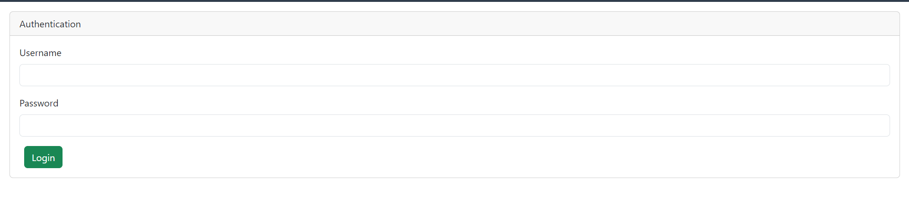
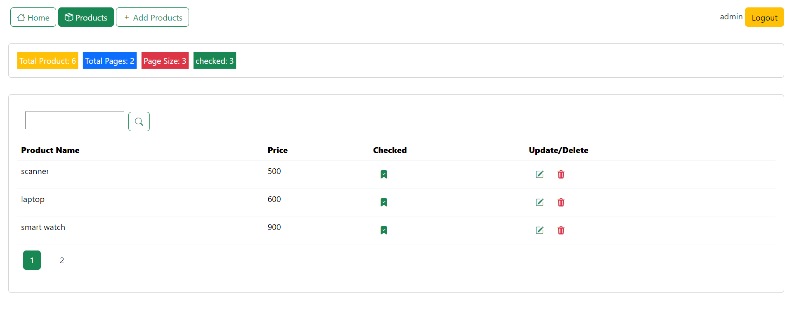
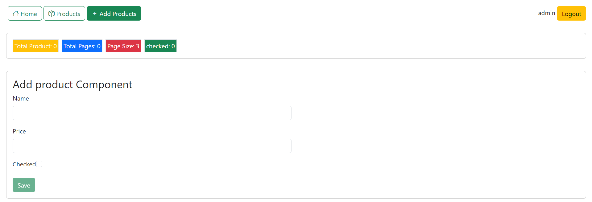
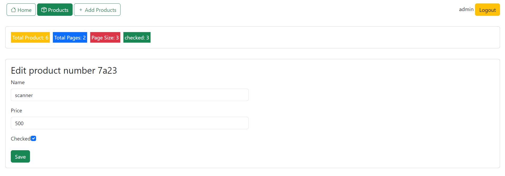
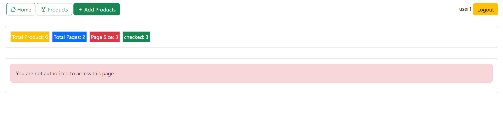

# Angular Project with JSON Server, Bootstrap, and Bootstrap Icons

This project demonstrates a complete Angular application using JSON Server as the backend. The application features include creating, reading, updating, deleting (CRUD) operations, pagination, authentication, and state management. Bootstrap and Bootstrap Icons are used for styling and UI components.

## Table of Contents
1. [Setting Up Angular Environment](#setting-up-angular-environment)
2. [Project Structure and Bootstrap](#project-structure-and-bootstrap)
3. [Component Creation and Data Binding](#component-creation-and-data-binding)
4. [Services and HTTP Requests](#services-and-http-requests)
5. [Application Features and Functions](#application-features-and-functions)
6. [Component Communication & Centralized State Management](#component-communication--centralized-state-management)
7. [Refactoring for Better Data Management](#refactoring-for-better-data-management)
8. [Implementing an Interceptor](#implementing-an-interceptor)
9. [Dashboard Component Creation](#dashboard-component-creation)
10. [Future Plans for Authentication & Presenting](#future-plans-for-authentication--presenting)
11. [Screenshots](#screenshots)

## Setting Up Angular Environment
1. Install Node.js from [Node.js official website](https://nodejs.org/).
2. Install Angular CLI globally:
   ```bash
   npm install -g @angular/cli
   ```
3. Create a new Angular project:
   ```bash
   ng new angular-project
   ```
   Choose CSS for styling and include Angular's routing system when prompted.

## Project Structure and Bootstrap
1. Navigate to the project directory:
   ```bash
   cd angular-project
   ```
2. Install Bootstrap and Bootstrap Icons:
   ```bash
   npm install bootstrap bootstrap-icons
   ```
3. Add Bootstrap and Bootstrap Icons to `angular.json`:
   ```json
   "styles": [
     "node_modules/bootstrap/dist/css/bootstrap.min.css",
     "node_modules/bootstrap-icons/font/bootstrap-icons.css",
     "src/styles.css"
   ],
   "scripts": [
     "node_modules/bootstrap/dist/js/bootstrap.bundle.min.js"
   ]
   ```

## Component Creation and Data Binding
1. Generate a new component:
   ```bash
   ng generate component product
   ```
2. Use string interpolation and data binding in the component template:
   ```html
   <div>{{ product.name }}</div>
   <input [(ngModel)]="product.name" />
   ```

## Services and HTTP Requests
1. Generate a service:
   ```bash
   ng generate service product
   ```
2. Use `HttpClient` in the service to make HTTP requests:
   ```typescript
   import { HttpClient } from '@angular/common/http';
   
   constructor(private http: HttpClient) { }

   getProducts() {
     return this.http.get('/api/products');
   }
   ```

## Application Features and Functions
1. Display product lists using `ngFor`:
   ```html
   <div *ngFor="let product of products">{{ product.name }}</div>
   ```
2. Implement CRUD operations:
  - **Create**: Form to add new products.
  - **Read**: Display product list.
  - **Update**: Form to edit existing products.
  - **Delete**: Button to remove products.

## Component Communication & Centralized State Management
1. Create a centralized state service:
   ```bash
   ng generate service appState
   ```
2. Use the state service for component communication:
   ```typescript
   @Injectable({
     providedIn: 'root'
   })
   export class AppStateService {
     private products = new BehaviorSubject<Product[]>([]);
     currentProducts = this.products.asObservable();
   
     updateProducts(products: Product[]) {
       this.products.next(products);
     }
   }
   ```

## Refactoring for Better Data Management
Move state data from individual components into the centralized state service for better data management and accessibility.

## Implementing an Interceptor
1. Create an HTTP interceptor to manage loading states and errors:
   ```bash
   ng generate interceptor loading
   ```
2. Use the interceptor to handle HTTP requests globally:
   ```typescript
   @Injectable()
   export class LoadingInterceptor implements HttpInterceptor {
     intercept(req: HttpRequest<any>, next: HttpHandler): Observable<HttpEvent<any>> {
       // Handle loading indicator and errors
     }
   }
   ```

## Dashboard Component Creation
1. Generate a dashboard component:
   ```bash
   ng generate component dashboard
   ```
2. Display metrics using the centralized state service:
   ```html
   <div>Total Products: {{ totalProducts }}</div>
   ```

## Future Plans for Authentication & Presenting
1. Implement authentication with a secure backend using Spring Security.
2. Enhance the example with forms, modifying routes, and handling user roles and authentication states within Angular.

## Screenshots
this screenshots of the application showing different functionalities like Authentication, product listing, forms, and dashboard.

1. **Login**
   
2. **Product Listing**
   

3**Add Product**
   

4**Edit Product**
   
4**Not Authorized Users**
   

## Development Steps

### Step 1: Set Up the Development Environment
1. Install Node.js and Angular CLI.
2. Create a new Angular project.
3. Install Bootstrap and Bootstrap Icons.

### Step 2: Project Structure and Bootstrap
1. Navigate to the project directory.
2. Configure Bootstrap and Bootstrap Icons in `angular.json`.

### Step 3: Component Creation and Data Binding
1. Generate necessary components.
2. Implement string interpolation and data binding.

### Step 4: Services and HTTP Requests
1. Generate services for handling HTTP requests.
2. Implement CRUD operations.

### Step 5: Centralized State Management
1. Create a centralized state service.
2. Refactor components to use the state service.

### Step 6: Implementing an Interceptor
1. Create an HTTP interceptor for managing loading states and errors.
2. Use the interceptor globally.

### Step 7: Dashboard Component
1. Generate a dashboard component.
2. Display metrics using the state service.

### Step 8: Future Enhancements
1. Implement authentication.
2. Review progress and discuss improvements.

## Getting Started

To get a local copy up and running follow these simple steps.

### Prerequisites

- Node.js
- Angular CLI

### Installation

1. Clone the repo:
   ```bash
   git clone https://github.com/your-username/angular-jsonserver-bootstrap.git
   ```
2. Install NPM packages:
   ```bash
   npm install
   ```
3. Start the Angular application:
   ```bash
   ng serve
   ```
4. Start JSON Server:
   ```bash
   json-server --watch db.json --port 8089
   ```

## Usage

1. Navigate to `http://localhost:4200/` to view the application.
2. Use the provided UI to manage products.

## License

Distributed under the MIT License. See `LICENSE` for more information.

---

Feel free to modify the README as per your project requirements and add any additional details necessary.
